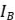

# PCB DESIGN

1. **Schematic Design** 
1. *3.3V Regular* 

2. *ESP32-WROOM32* 

   

3. *Slide Switch for the MCU* 

   

4. *Current Sensor using TA12 and TA17* 

   

5. *RS-485 ad RJ-45* 

   

6. *High Current LED* 

   

2. **PCB Layout** 

   

   

   

3. **Answering the question** 
1. **Research on the Internet and list 5 different current sensors that you** 

**can find. Along with each current sensor, please (1) give a reference source, (2) maximum current that the sensor can measure, and (3) how to obtain its values (e.g, using ADC, UART, I2C or SPI and so on).** 

- **TIPD135 high-side current sensing:** 

Reference Source: Texas instruments 

Maximum Current: 100 mA 

How to Obtain Values: enables measurement by common 5V ADCs 

- **ACS712 current sensor:** 

Reference Source: Wat Electronics  

Maximum Current: 5A, 20A, 30A versions 

How to Obtain Values: Analog ouput 

- **INA254 current-sense amplifier with PWM rejection and shunt resistor:** 

Reference Source: Texas instruments 

Maximum Current: 75A 

How to Obtain Values: current measurements in a motor-drive application, and for solenoid valve control applications.**  

- **AEC-Q100 Hall-effect current sensor:** 

Reference Source: Texas instruments Maximum Current: 20A 

How to Obtain Values: Analog ouput 

- **ACREL AKH split curent transformer:** 

Reference Source: Acrel 

Maximum Current: 400A 

How to Obtain Values: Provides a proportional current or voltage output. 

2. **In Figure 1.4, what is the voltage of SW1 when slide switch 1 is ON?** 

**and is OFF?** 

This circuit is referred to as a pull-up resistor in Figure 1.4. In the event that there is no input signal, pull-up resistors are employed to make sure that a wire is pulled to a high logical level. Accordingly, the SW1 wire would have a low logical signal (about 0) when the Switch 1 is in the ON mode, and a high logical signal (3.3V) when the Switch 1 is in the OFF mode. 

3. **In Figure 1.5, what is the voltage of ADC1\_CH7? of ADC1\_CH6?** 

At the ADC1\_CH7, the first op-amp is a voltage follower, so ![ref1]=.  Using the voltage divider, we can calculate the ![ref1] at U3B op-amp:  

We can apply the voltage divider to calculate the ![ref1] at the U3A op-amp: 

While at the U3A op-amp, this is a voltage follower with gain op-amp, so the  should be calculated using this formula: 

4. **In Figure 1.5, we apply a low pass filter to the signal ADC\_IN. What is** 

**the cutoff frequency of this low pass filter? If we want to set a cutoff frequency is about 10kHz, what should we change in the circuit of U3A?** 

The cut-off frequency when applying the low pass filter:  

While the capacitor is not easy to replace and change because of its price, we can change the resistor by adding another resistor next to R16 in the figure or replace the R16 resistor with a higher value resistor accordingly.  

At 10kHz cut-off frequency:  

So, we can add another 158![ref2] resistor, or we can change the R16 resistor to a higher value resistor at approx. 159.1![ref2]

5. **How much do the currents go through each LED in Figure 1.7? What** 

**should we do if we want to control a 100mW LED?** 

This LED is a complete diode which includes a rheostat at 330R and a diode, so the LED0 and LED1 should be similar and have the same value. Therefore, we just have to calculate 1 value of LED0 or LED1.  

In this case, LED0 is used to calculate the value.  

We can calculate the value of ![ref3], which will be the current through LED0. We will calculate the value of  and then, we will calculate the ![ref3]: 

To control the 100mW LED, we will assume that Q1 transistor is saturated, the  and  should have the value at: 

We will calculate the voltage at LED0:  

Next, in order to calculate ![ref4], we will need the resistance value of the rheostat:  

In conclusion, the currents go through each LED is at 53.8mA, while when controlling a 100mW LED, we need to adjust the value of the rheostat at R=0.1152Ω, the transistor will be in saturated mode, so the current go through 

the LED should be equal to the . 

6. **What is the main purpose of D2 in Figure 1.6?** 

D2 protects the MAX3485 by acting as an EMI filter and reverse-voltage clamp. By forward-biasing current from the SVO pin to ground during low RS-485 EN, D2 prevents negative voltage excursions that can damage the transceiver. Moreover, clean signal transmission is ensured by the attenuation of high- frequency EMI noise by the impedance characteristics of D2. 

[ref1]: README_PIC/Aspose.Words.493ad605-28fb-4931-85ae-ed62317a46cc.022.png
[ref2]: README_PIC/Aspose.Words.493ad605-28fb-4931-85ae-ed62317a46cc.032.png
[ref3]: README_PIC/Aspose.Words.493ad605-28fb-4931-85ae-ed62317a46cc.033.png
[ref4]: README_PIC/Aspose.Words.493ad605-28fb-4931-85ae-ed62317a46cc.043.png
